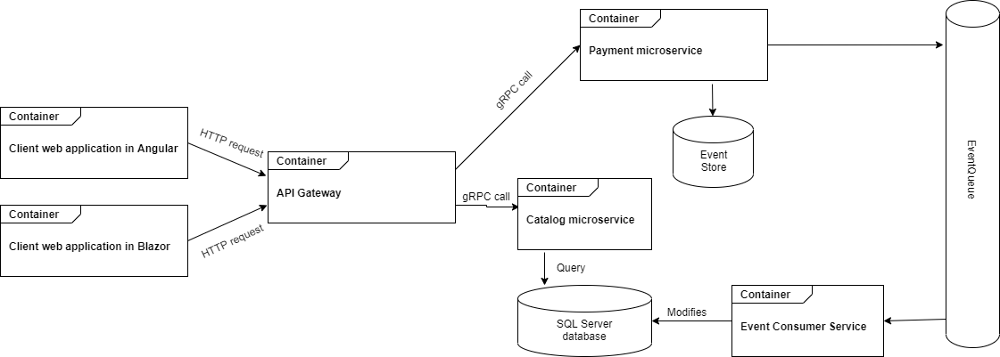

# NewPlace

Web application for real estate advertisements. Clients developed with Angular and Blazor. Api developed with ASP.NET Core.

## Patterns / Techniques
- Onion Architecture
- Microservice Architecture
- Domain Driven Design
- CQRS
- Event Sourcing
- Behaviour Driven Development
- Mediator
- Factory
- Event Bus
- Singleton
- Command

## Technologies
- ASP.NET Core
- Angular
- Blazor
- Entity Framework Core
- Dapper
- OpenApi
- gRPC
- FluentValidation
- RabbitMQ
- MediatR
- SignalR
- xUnit
- xBehave
- FluentAssertions
- Automapper

## Components diagram

